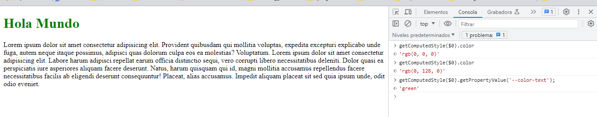
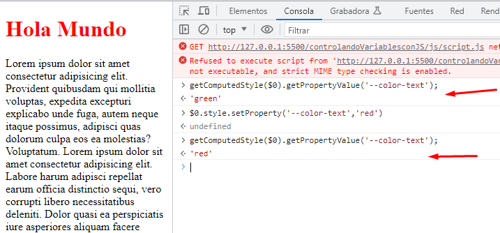

# Controlando variables css con JS

## CSSOM

window:
getComputedStyle() : Te devuelve un objeto con todas las propiedades css despues que el navegador los calculó.

getComputedStyle($0).getPropertyValue('--color-text)

---

Para recuperar una variable css de un elemento:
getComputedStyle(elemento).getPropertyValue('--variable')

$0.style.setProperty('--color-text','red');

para setear una variable css es:
element.style.setProperty('--variable','valueNew')

getComputedStyle.document.documentElement 

const
